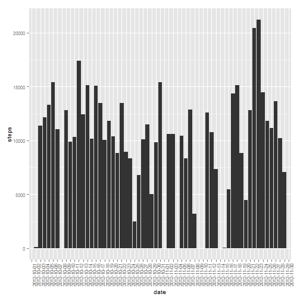
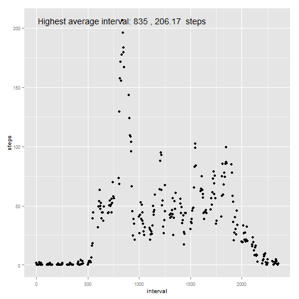
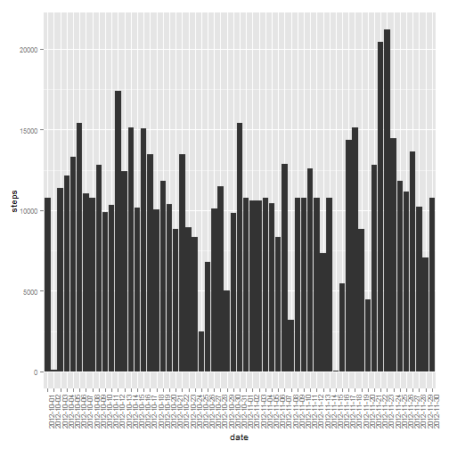

---
Title: "Assigment1 Reproducible Research"

========================================================================


```r
library(ggplot2)
library(plyr)
d<-read.csv("Activity.csv")
```

#### 1) What is mean total number of steps taken per day?  
To plot the total numbers of steps per day, a subset is created first using the ddply function. Then the histogram is plotted using the qplot function.


```r
s2<-ddply(d,.(date),summarize,steps=sum(steps,na.rm=TRUE))

qplot(x=date, y=steps,data=s2, geom="bar", stat="identity", position="dodge") + theme(text = element_text(size=10),                                               axis.text.x = element_text(angle=90, vjust=1))
```

 

And the mean and median are calculated using the same subset s2 and stored in the "Steps_mean" and "Steps_median" variables


```r
Steps_mean<-mean(s2$steps)
Steps_median<-median(s2$steps)
print(paste("Mean total number of steps taken per day:",Steps_mean))
```

```
## [1] "Mean total number of steps taken per day: 9354.22950819672"
```

```r
print(paste("Median total number of steps taken per day:",Steps_median))
```

```
## [1] "Median total number of steps taken per day: 10395"
```
#### 2) What is the average daily activity pattern?  
The average per interval is calculated with ddply function and stored in a subset "stepsxint".
The subset is plotted with qplot, highlighting the point (interval) with the highest average of steps through the geom_text function.


```r
stepsxint<-ddply(d,.(interval),summarize,steps=mean(steps,na.rm=TRUE))
qplot(x=interval, y=steps, data=stepsxint, geom="point", stat="identity", position="dodge") + theme(text = element_text(size=10))+geom_text(data=subset(stepsxint, steps==max(stepsxint$steps)),aes(interval,steps,label=paste("Highest average interval:",interval,",",round(steps,digits=3)," steps")))
```

```
## ymax not defined: adjusting position using y instead
```

 

#### 3)Imputing missing values

To stablish the amount of missing values in the dataset, we subset the data by taking only the TRUE values of the is.na() function, and apply the nrow function to the result.

To replace the missing values with the corresponding interval mean, a merged subset "mi"  was created to add the value to be replaced as an additional column.
Then looping through the matrix, all NA values were replaced with the new column value.


```r
nrow(m<-d[is.na(d$steps),])
```

```
## [1] 2304
```

```r
mi<-merge(d,stepsxint,by.x="interval",by.y="interval")
for (i in seq_along(mi$interval))
{
 if(is.na(mi[i,"steps.x"])) {mi[i,"steps.x"]<-mi[i,"steps.y"]} 
 else{next}
}
mi$steps.y<-NULL
colnames(mi)[2]<-"steps"
```

With the new dataset that equal to the original but with filled NA values, the steps for plotting the total daily steps and calculating the mean and median are repeated.

```r
mi2<-ddply(mi,.(date),summarize,steps=sum(steps,na.rm=TRUE))

qplot(x=date, y=steps,data=mi2, geom="bar", stat="identity", position="dodge") + theme(text = element_text(size=10),                                               axis.text.x = element_text(angle=90, vjust=1))
```

 

```r
Steps_mean2<-mean(mi2$steps)
Steps_median2<-median(mi2$steps)
print(paste("Mean total number of steps taken per day:",Steps_mean2))
```

```
## [1] "Mean total number of steps taken per day: 10766.1886792453"
```

```r
print(paste("Median total number of steps taken per day:",Steps_median2))
```

```
## [1] "Median total number of steps taken per day: 10766.1886792453"
```
The impact of filling NA values was an increase in the average steps per day.  Now the median equals the average.

####Are there differences in activity patterns between weekdays and weekends?

The original subset d is extended by adding a new column with the number of the weekday (0-7).
Based on this new column, using the ifelse() function the factor variable "weekday" is created with to separate the data in two group: weekends for days 0 and 7 (Sat-Sun) and the rest as weekend.

Then a new aggregated subset "wd" with the average number of step by interval and weekday is created and plotted.

The plot is generated and splited using the facet parameter by the weekday factor variable.

```r
d$wday<-as.POSIXlt(d$date)$wday
d$weekday<-ifelse((d$wday==0)|(d$wday==7),"weekend","weekday")
wd<-ddply(d,.(weekday,interval),summarize,steps=mean(steps,na.rm=TRUE))
wd$weekday<-factor(wd$weekday,levels=c("weekend","weekday"),labels=c("weekends","weekday"))
qplot(x=interval, y=steps,data=wd, geom="line",facets=weekday~.)
```

 
Looking at the graphs we can see how on weekend the activity increases and is more evenly distributed, presenting several peaks accross the day, while on weekdays we see a single peak in the morning and less activity during the rest of the day.
